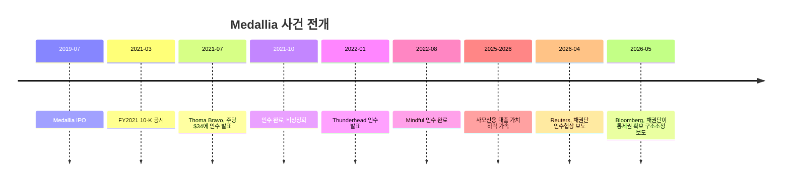
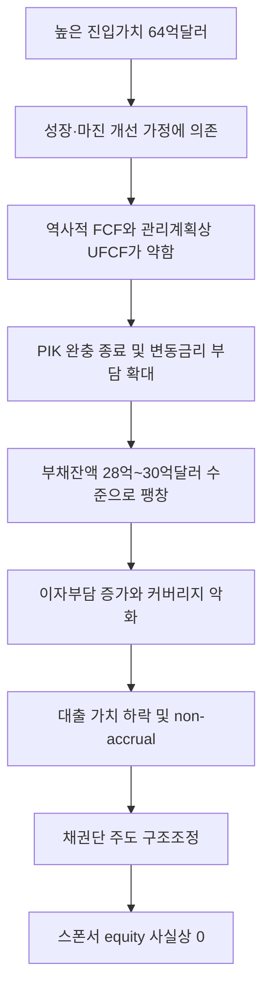

# Medallia 사례로 본 SaaS 기업가치 평가

## Executive Summary

Medallia 사례는 “좋은 SaaS 자산”과 “좋은 LBO 자산”이 항상 같지 않다는 점을 보여준다. Medallia는 상장 시기까지 높은 구독 비중, 110%를 웃도는 순매출 유지율, 빠른 고객 기반 확대를 보인 기업이었지만, 동시에 상장사 시절에도 영업손실과 순손실이 지속됐고 영업현금흐름은 매우 얇았다. 특히 공개된 2021년 매각 프록시의 관리계획상으로도 2022E~2025E까지 무차입 잉여현금흐름이 계속 음수였다는 점은, 인수 논리가 본질적으로 “가까운 미래의 현금창출력”보다 “장기 성장과 후행적인 마진 전환”에 크게 의존했음을 시사한다. citeturn5view3turn25view1turn28view0turn37view0

Thoma Bravo의 2021년 Medallia 인수는 헤드라인 기준 64억 달러였고, 거래자금 중 부채조달은 18억 달러였다. OnlyCFO와 최근 대형 매체 보도를 종합하면, sponsor 및 공동투자자 측 equity at risk는 약 50억~51억 달러로 추정되며, 2026년 구조조정 국면에서 그 지분가치는 사실상 전액 소멸하는 방향으로 전개됐다. 2026년 4~5월 기준 Bloomberg·Reuters·WSJ·Barron’s·FT 보도와 Blackstone BCRED의 8-K는 Medallia가 채권단 중심의 재편으로 넘어가고 있으며, 관련 차입은 약 28억~30억 달러 수준으로 불어나 있었고, BCRED는 해당 익스포저를 60.3으로 평가하며 non-accrual로 분류했다고 보여준다. citeturn15view0turn12search1turn13search0turn19search5turn32news35turn33view0

핵심은 “얼마나 비싸게 샀는가”만이 아니라 “어떤 지표를 근거로 비싸게 샀는가”다. Medallia의 공개 프록시에 따르면 Morgan Stanley는 관리계획상 FY2022E 매출 5.78억 달러, FY2023E 7.08억 달러, FY2025E 10.74억 달러를 사용했고, 공개시장 비교법에서는 CY2022E 기준 6.0x~13.0x EV/Revenue, DCF에서는 주당 20.01~38.36달러의 범위를 제시했다. 헤드라인 거래가치 64억 달러를 FY2023E 매출 7.08억 달러로 나누면 약 9.0x가 되어 OnlyCFO의 “약 9x NTM revenue” 주장과 방향상 부합한다. 다만 같은 프록시에서 FY2025E까지도 unlevered FCF가 음수였다는 점을 감안하면, 그 9x는 “성장률이 유지되고 이후 현금화가 성공한다”는 강한 전제 하에서만 정당화될 수 있었다. citeturn30view0turn28view0turn27view3turn17view0

따라서 Medallia가 주는 교훈은 명확하다. SaaS 가치평가에서 EV/Revenue나 ARR multiple은 여전히 유용하지만, 그것이 합리적이려면 적어도 네 가지가 함께 검증되어야 한다. 첫째, retention이 높은가. 둘째, gross margin이 높은가. 셋째, 성장이 아니라 성장의 “질”이 유지되는가. 넷째, 그 성장이 결국 FCF로 연결되는가. Medallia는 앞의 둘에서는 강점이 있었지만, 뒤의 둘—특히 레버리지를 감당할 정도의 현금전환—에서 취약성이 드러났다. 그 결과, valuation multiple의 작은 하향과 금리·PIK 조건 변화가 equity wipeout으로 증폭됐다. citeturn25view1turn37view0turn37view1turn33view0turn13search4

## 사건 개요와 핵심 쟁점

Medallia는 2021년 7월 Thoma Bravo와 합병계약을 체결했고, 주주들은 주당 34달러 현금을 받는 구조였다. 회사 측 보도자료는 거래가치를 64억 달러로 제시했으며, 이는 2021년 6월 10일의 “루머 발생 전” 종가 대비 약 20%, 30일 평균가 대비 약 29% 프리미엄이었다. 거래는 2021년 10월 완료됐다. citeturn15view0turn11search4

OnlyCFO 기사와 2026년의 Reuters·Bloomberg·WSJ·Barron’s·FT 보도를 합치면, 사건의 골자는 다음과 같다. Medallia는 2021년 팬데믹기 소프트웨어 밸류에이션 정점 부근에서 매입됐고, 이후 기대했던 성장률과 현금화가 충분히 실현되지 못했다. 여기에 PIK 완충장치의 종료, 변동금리 환경, 추가 차입 또는 인수자금 부담이 겹치면서 debt service가 급격히 무거워졌고, 결국 sponsor가 추가 equity를 넣지 않으면서 채권단이 회사를 넘겨받는 구조조정으로 이동했다는 것이다. 이 과정에서 sponsor equity 약 51억 달러가 사실상 wipeout되는 것으로 보도됐다. citeturn17view0turn13search0turn19search5turn32news35turn12news42turn12news43

다만 엄밀하게 보면, OnlyCFO의 일부 수치—예컨대 “연 EBITDA 약 2억 달러”, “연 이자부담 약 3억 달러”, “원래 18억 달러 대출이 22억 달러를 거쳐 28억~30억 달러로 증가” 같은 항목—은 상장폐지 이후 Medallia가 비공개사가 된 탓에 공식 재무제표로 직접 검증하기 어렵다. 따라서 본 보고서는 이를 “시장·기사 기반 추정”으로 취급하고, 공식문서로 확인되는 부분과 분리해 해석한다. citeturn17view0turn18search1turn19search5turn33view0

위 타임라인에서 valuation 관점의 핵심 분기점은 두 번이다. 첫 번째는 2021년 거래 시점으로, 공개 프록시의 management case가 매우 강한 성장 곡선을 전제한 반면 역사적 현금창출은 약했다는 점이다. 두 번째는 2025~2026년으로, 사모신용 시장에서 Medallia 대출의 공정가치가 급락하고 non-accrual로 전환되면서 “equity cushion”이 실질적으로 사라진 시점이다. citeturn28view0turn30view0turn33view0

## 재무 실적과 SaaS 지표

Medallia의 공개 재무는 2018~2021 회계연도와 2021년 7월 31일 종료 반기까지 확인된다. 회계연도는 매년 1월 31일 종료 기준이다. 역사적 숫자를 보면 매출은 2018년 2.61억 달러에서 2021년 4.77억 달러로 늘었지만, 영업손실과 순손실도 함께 확대됐다. 영업현금흐름은 2018년에는 흑자였으나 2019~2020년에는 다시 약세였고, 2021년에도 사실상 breakeven 수준이었다. citeturn5view1turn5view3turn34view0turn34view1

### 연도별 재무제표 요약

| 회계연도 | 총매출 | 영업이익/손실 | 순이익/손실 | 영업현금흐름 | 총매출 성장률 | 총매출 대비 OCF |
|---|---:|---:|---:|---:|---:|---:|
| 2018 | 261.2 | -71.1 | -70.4 | 16.4 | 미확인 | 6.3% |
| 2019 | 313.6 | -80.4 | -82.2 | -15.2 | 20.1% | -4.8% |
| 2020 | 402.5 | -114.9 | -112.3 | -1.6 | 28.3% | -0.4% |
| 2021 | 477.2 | -138.0 | -148.7 | 1.7 | 18.6% | 0.3% |

주: 단위는 백만 달러, 성장률과 OCF 비율은 필자 계산이다. FY2018~FY2019는 S-1, FY2019~FY2021은 FY2021 10-K 기준이다. citeturn5view1turn5view3turn34view0turn34view1

이 표가 시사하는 바는 단순하다. Medallia는 “매출성장형 SaaS”였지만 “현금창출형 SaaS”는 아니었다. 특히 상장 직전·직후의 재무는 투자확대가 강했고, 공개 프록시의 management case조차 FY2025E까지 unlevered free cash flow가 음수였다. 이는 인수 시점 valuation이 역사적 FCF가 아니라 장기 성장률과 미래 margin expansion에 거의 전적으로 의존했음을 뜻한다. citeturn28view0turn27view3

### 핵심 SaaS 지표 연도별 정리

Medallia는 상장사 시절 “고객 수”, “subscription billings”, “dollar-based net revenue retention”을 핵심 지표로 공시했다. 반면 ARR, 절대 ACV, net new ARR/ACV, CAC, LTV, gross revenue retention, gross churn은 숫자 자체를 공개하지 않았다. 따라서 아래 표에서는 공시된 지표와 공개자료로 무리 없이 계산 가능한 proxy만 사용하고, 미공개 항목은 ‘미확인’으로 표기한다. citeturn25view1turn25view0turn7view1

| 연도 | Subscription billings | Billings 성장률 | DBNRR | Enterprise customers | Parent 기준 고객 수 | Gross margin | ARPU proxy | Net churn proxy |
|---|---:|---:|---:|---:|---:|---:|---:|---:|
| 2018 | 233.8 | 24% | 126% | 미확인 | 미확인 | 63.3% | 미확인 | -26% |
| 2019 | 289.5 | 24% | 116% | 543 | 350 | 63.0% | 0.455 | -16% |
| 2020 | 360.8 | 25% | 119% | 757 | 513 | 63.9% | 0.412 | -19% |
| 2021 | 411.5 | 14% | 115% | 1,077 | 787 | 64.2% | 0.355 | -15% |
| 2021-07 TTM | 472.0 | 24% | 112% | 1,340 | 984 | 63.0% 내외 | 0.316 | -12% |

주: 단위는 billings·ARPU proxy는 백만 달러가 아니라, ARPU proxy의 경우 “백만 달러/고객”이 아니라 “십억 단위 환산 없이 달러 백만 기준 숫자”가 아니라 오해를 피하기 위해 아래 설명을 참고해야 한다. ARPU proxy는 “subscription revenue ÷ 연말 enterprise customers”로 계산한 단순치이며, 실제 ARPU 공시는 아니다. Net churn proxy는 100%-DBNRR로 계산한 순매출 churn의 역수준이며, gross churn이 아니다. FY2018~FY2019 billings·DBNRR은 S-1, FY2021 10-K는 FY2019~FY2021 고객 수·billings·DBNRR, 2021-07 TTM은 10-Q 기준이다. citeturn25view0turn25view1turn26view4turn9view0turn9view1turn9view2turn9view3

표에서 가장 먼저 보이는 장점은 retention이다. DBNRR이 2018~2021 동안 115%~126% 범위라는 것은 기존 고객군에서 upsell·cross-sell이 churn을 상쇄하고도 남았다는 뜻이다. Gross margin도 63%~64% 수준으로 안정적이었다. 이는 제품이 원가구조상 SaaS로서 충분히 매력적인 특성을 갖고 있었음을 보여준다. citeturn26view4turn25view1turn5view1turn5view3

그러나 약점도 분명했다. 첫째, 2021년 billings 성장률은 14%로 한 차례 크게 둔화했다. 회사는 10-K에서 코로나 충격을 받은 고객에게 계약연장과 맞바꾼 유연한 지급조건을 제공했다고 설명했다. 둘째, enterprise customer 수는 급격히 늘었는데 ARPU proxy는 하락했다. 이는 고객 믹스가 더 넓어지면서 개별 계약가치가 희석됐거나, 대형 고객 확장보다 신규 로고 확보 비중이 커졌을 가능성을 시사한다. 셋째, 높은 NRR에도 불구하고 공개재무상 영업현금창출은 여전히 약했다. 즉, “좋은 retention”이 “좋은 leverage coverage”로 자동 전환되지는 않았다. citeturn25view1turn9view2turn37view0

| 항목 | 공개 여부 | 판정 |
|---|---|---|
| ARR 절대액 | 미공시 | 미확인 |
| ACV 절대액 | 미공시 | 미확인 |
| 신규/순증 ARR | 미공시 | 미확인 |
| Net new ACV | 내부 KPI 언급만 존재 | 미확인 |
| CAC | 미공시 | 미확인 |
| LTV | 미공시 | 미확인 |
| Gross revenue retention | 미공시 | 미확인 |
| Gross churn | 미공시 | 미확인 |

주: S-1은 경영진 보너스 설계에서 “SaaS net new annual contract value”를 언급하지만, 절대 금액은 공개하지 않는다. 따라서 CAC·LTV·GRR·gross churn은 공개 공시로 검증 가능한 수치가 없다. citeturn7view1turn25view1

## Thoma Bravo 투자구조와 손실 발생 메커니즘

공식적으로 확인되는 구조는 다음과 같다. Medallia 인수의 헤드라인 거래가치는 64억 달러였고, 2021년 발표문은 부채조달을 Blackstone Credit, Apollo 계열, KKR Credit, Thoma Bravo Credit, Antares Capital이 제공한다고 밝혔다. Bloomberg는 당시 이 인수를 뒷받침한 LBO loan이 18억 달러라고 보도했다. 최근 Barron’s는 Blackstone이 그중 15억 달러를 제공한 최대 대주라고 정리했다. citeturn15view0turn12search1turn12news42

OnlyCFO 및 Reuters 보도의 equity 손실 규모를 감안하면 sponsor 및 co-investor가 위험에 노출한 equity는 약 50억~51억 달러 수준으로 추정된다. 다만 이 숫자와 18억 달러 debt를 단순 합산하면 68억~69억 달러가 되어 64억 달러 headline value와 정확히 일치하지 않는다. 이는 거래수수료, 기존 현금·부채 조정, capped call/전환사채 정산, 기타 source-and-use 항목이 헤드라인 value와 별도이기 때문일 수 있으나, 해당 브리지 전체는 공개자료로 완전 재구성되지 않는다. 따라서 본 보고서는 자금구조를 “대략 26% debt / 74% equity의 고 equity LBO”로만 해석하고, 상세 source-and-use는 ‘미확인’으로 둔다. citeturn15view0turn12search1turn13search0turn12news42

중요한 점은 “레버리지가 낮았으니 안전했다”는 논리가 시간이 지나면 무효화될 수 있다는 것이다. Barron’s는 Blackstone이 원시점 LTV를 약 26%로 보았다고 전했지만, 이후 Medallia 대출은 수년간 mark-down됐고, 2026년 3월 31일 기준 BCRED는 Medallia를 60.3으로 평가하며 non-accrual에 포함시켰다. 같은 시기 Bloomberg와 Reuters는 Medallia 총차입이 대략 28억~30억 달러 수준이며, Thoma Bravo가 추가 자본투입을 거부한 뒤 채권단이 통제권을 가져가는 구조조정이 진행 중이라고 보도했다. 즉, 초기에 낮아 보이던 LTV는 “기업가치 하락”과 “부채잔액 증가”가 동시에 일어나면 순식간에 방어력을 잃는다. citeturn12news42turn33view0turn19search5turn13search0turn32news35

이 메커니즘을 “가치평가 언어”로 번역하면 다음과 같다. Medallia는 이익 또는 FCF 기반 valuation으로는 방어하기 어려웠기 때문에, 거래 정당화는 사실상 EV/Revenue와 장기 terminal value에 기대야 했다. 그런데 프록시에 공개된 management case를 보면 FY2022E 매출 5.78억 달러가 FY2025E 10.74억 달러로 약 23% CAGR 성장을 보이는 동안에도 EBITDA는 2025E에야 6,600만 달러 흑자로 전환되고, unlevered FCF는 2025E에도 -3,200만 달러였다. 다시 말해 sponsor가 산 것은 “현재의 cash flow”가 아니라 “몇 년 뒤의 scale economics”였다. 이 구조는 rate shock, debt accrual, multiple compression에 매우 취약하다. citeturn28view0turn30view0turn21search0

손실 메커니즘을 가장 직관적으로 보여주는 보조 스트레스 테스트는 아래와 같다. 여기서 EBITDA 2억 달러는 OnlyCFO가 제시한 시장추정치이므로 공식 공시로는 미확인이다. 다만 구조를 이해하는 데는 유용하다. citeturn17view0turn19search5

| 가정 | 보수적 | 기준 | 스트레스 |
|---|---:|---:|---:|
| 총차입 가정 | 28억 달러 | 29억 달러 | 30억 달러 |
| 평균 현금이자율 가정 | 7% | 9% | 11% |
| 연간 이자부담 | 1.96억 달러 | 2.61억 달러 | 3.30억 달러 |
| EBITDA 가정 | 2.00억 달러 | 2.00억 달러 | 2.00억 달러 |
| EBITDA/이자 커버리지 | 1.02x | 0.77x | 0.61x |

주: debt는 Bloomberg·Reuters의 28억~30억 달러 보도 범위, EBITDA 2억 달러는 OnlyCFO가 제시한 시장추정치이며 공식 재무공시로는 미확인이다. 이 표는 실적 재구성이 아니라 손실 메커니즘 이해를 위한 민감도 예시다. citeturn19search5turn13search0turn17view0

## 가치평가 방법론 비교와 Medallia 적용

SaaS 가치평가에서 DCF, EV/Revenue, ARR multiple, Rule of 40은 서로 경쟁하는 방법이 아니라 서로의 맹점을 보완하는 방법이다. DCF는 원칙적으로 가장 엄밀하지만, 고성장 SaaS에서는 terminal value 비중이 과도해질 수 있다. Revenue multiple은 이익적자가 큰 구간에서 실무적으로 유용하지만, margin structure를 외면하면 고평가 위험이 크다. ARR multiple은 recurring revenue의 질을 잘 반영하지만, ARR의 정의와 계약질 차이 때문에 비교오류가 쉽다. Rule of 40은 valuation 그 자체가 아니라 “어떤 multiple이 정당한가”를 가늠하는 질적 필터로 쓰는 것이 적절하다. citeturn21search9turn21search10turn36view0turn37view0turn37view1

| 방법 | 핵심 식 | 장점 | 한계 | Medallia 적용상 의미 |
|---|---|---|---|---|
| DCF | FCFF의 현재가치 + Terminal Value | 가장 원칙적 | 고성장 SaaS는 terminal 의존도 큼 | 프록시상 2025E까지 UFCF 음수라 민감도 매우 큼 |
| EV/Revenue | EV ÷ 매출 | 적자 SaaS 비교에 유용 | margin·retention 반영이 간접적 | 2021 거래가 이 방식에 크게 의존 |
| ARR multiple | EV ÷ ARR | recurring 매출의 질 반영 | ARR 정의 차이, 공개치 부족 | Medallia는 ARR 미공시라 billings proxy 필요 |
| Rule of 40 | 성장률 + FCF or EBITDA margin | valuation의 품질 필터 | 절대가치 직접 산출은 아님 | Medallia는 공개자료 기준 40에 크게 못 미침 |

주: DCF·Revenue multiple의 이론적 틀은 Damodaran, Rule of 40의 실무 연계는 McKinsey·BCG, private/public SaaS multiple 해석은 SaaS Capital 참고. Medallia 적용 포인트는 공개 프록시와 10-K/10-Q를 결합한 해석이다. citeturn21search9turn21search10turn37view0turn37view1turn36view0turn28view0turn30view0

Medallia의 경우 공식 management case가 valuation anchor를 제공한다. 프록시상 FY2022E 매출은 5.78억 달러, FY2023E는 7.08억 달러, FY2025E는 10.74억 달러다. 이 숫자에 헤드라인 거래가치 64억 달러를 나누면, 거래배수는 FY2022E 기준 약 11.1x, FY2023E 기준 약 9.0x다. 뒤의 수치는 OnlyCFO의 “약 9x NTM revenue”와 방향상 일치한다. 동시에 Morgan Stanley는 공개시장 비교법에서 CY2021E 8.0x~15.0x, CY2022E 6.0x~13.0x EV/Revenue 범위를 사용했고, DCF에서는 주당 20.01~38.36달러 범위를 제시했다. 즉, 거래가격 34달러는 당시 자문범위 안에 있었지만, 낮은 쪽보다 높은 쪽에 가까웠고, 무엇보다 management case 달성을 강하게 전제했다. citeturn30view0turn27view3turn17view0

### Medallia 적용 시나리오

| 방법 | 기준치 | 보수적 | 기준 | 낙관적 |
|---|---|---:|---:|---:|
| EV/Revenue on FY2022E | 매출 5.78억 달러 | 6.0x = 34.7억 달러 | 8.0x = 46.2억 달러 | 11.1x = 64.0억 달러 |
| Forward EV/Revenue on FY2023E | 매출 7.08억 달러 | 6.0x = 42.5억 달러 | 8.0x = 56.6억 달러 | 9.0x = 63.7억 달러 |
| ARR-proxy multiple | TTM subscription billings 4.72억 달러 | 5.0x = 23.6억 달러 | 8.0x = 37.8억 달러 | 13.0x = 61.4억 달러 |
| DCF official reference | Morgan Stanley | $20.01/share | 약 $29.2/share midpoint | $38.36/share |

주: EV/Revenue와 DCF 범위는 Medallia 프록시에 공개된 management case와 Morgan Stanley 분석을 사용했고, ARR-proxy는 ARR 미공시 문제 때문에 2021년 7월 TTM subscription billings를 대용치로 쓴 것이다. DCF midpoint는 단순 중간값이다. ARR-proxy 결과가 낮게 나오는 이유는 billings가 총매출보다 작고, retention·cash conversion·growth quality discount를 직접 반영하기 때문이다. citeturn28view0turn30view0turn9view2turn9view4turn36view0

이 시나리오가 보여주는 결론은 세 가지다. 첫째, 64억 달러는 “전혀 설명 불가능한 가격”은 아니었다. 공개 프록시의 낙관 시나리오에서는 EV/Revenue와 DCF 모두 이를 방어할 여지가 있었다. 둘째, 그러나 그 가격을 방어하려면 FY2023E 수준의 고성장과 이후 마진 전환이 현실로 이어져야 했다. 셋째, ARR-proxy 관점에서는 훨씬 보수적인 가치가 나오므로, 결국 이 거래는 recurring revenue의 질보다 성장률 지속과 후행적 margin story에 더 비중을 둔 valuation이었다고 해석할 수 있다. citeturn30view0turn28view0turn36view0

### 민감도 분석

| FY2023E 매출 / EV배수 | 6.0x | 8.0x | 9.0x | 11.0x |
|---|---:|---:|---:|---:|
| 6.50억 달러 | 39.0억 달러 | 52.0억 달러 | 58.5억 달러 | 71.5억 달러 |
| 7.08억 달러 | 42.5억 달러 | 56.6억 달러 | 63.7억 달러 | 77.9억 달러 |
| 7.60억 달러 | 45.6억 달러 | 60.8억 달러 | 68.4억 달러 | 83.6억 달러 |

주: 필자 계산. FY2023E 7.08억 달러는 Medallia management case, 배수는 프록시의 public comparables 및 precedent transaction 범위, 그리고 2025년 SaaS Capital이 제시한 public/private SaaS multiple 맥락을 반영한 예시다. 표가 의미하는 바는, 매출이 10%만 미달하거나 배수가 1~2턴만 낮아져도 EV가 수십억 달러 움직인다는 점이다. 레버리지 하에서는 이 차이가 거의 전부 equity에 반영된다. citeturn28view0turn30view0turn36view0turn35view2

Rule of 40 관점에서도 Medallia는 경고신호를 보였다. McKinsey는 SaaS에서 성장률 + FCF margin이 40%를 넘을수록 EV/Revenue multiple이 높아지는 경향을 보인다고 설명하고, BCG는 성장률 + EBITDA margin을 핵심 판별식으로 쓴다. Medallia는 공개자료 기준으로 2019~2021년 OCF proxy Rule of 40이 각각 약 15%, 28%, 19% 수준에 불과했고, management case상 FY2025E EBITDA margin도 6.1%에 그쳤다. 따라서 이 거래는 “Rule of 40을 이미 달성한 우량 SaaS”에 고배수를 준 것이 아니라, “아직 40에 못 미치는 기업이 언젠가 거기로 갈 것”이라는 옵션성에 프리미엄을 준 셈이었다. citeturn37view0turn37view1turn5view3turn34view0turn28view0

## 투자 리스크와 교훈

첫째 리스크는 거버넌스와 인센티브의 불일치다. 매각 프록시는 management case가 FY2025E까지 매우 강한 성장경로를 상정했음을 보여주지만, 동시에 같은 자료는 FY2025E까지도 unlevered FCF가 음수였음을 보여준다. 이런 구조에서는 sponsor, 경영진, 대주단이 같은 숫자를 보더라도 “누가 terminal risk를 지는가”가 다르다. Equity는 upside에 민감하고, debt는 downside protection에 민감하다. Medallia는 시간이 갈수록 그 차이가 극단적으로 벌어진 사례다. citeturn28view0turn27view3

둘째 리스크는 레버리지와 금리다. 소프트웨어 기업은 역사적으로 높은 gross margin과 recurring revenue 때문에 LBO 자산으로 선호됐지만, 그것이 즉시 높은 현금보상력을 의미하지는 않는다. OnlyCFO가 지적한 PIK 및 변동금리 문제는 사모신용 시장 전반의 경고와도 맞물린다. WSJ와 FT는 2026년 들어 private credit 펀드의 부담이 커지고 있음을 지적했고, BCRED 역시 Medallia를 non-accrual로 분류했다. 즉 “높은 gross margin”과 “낮은 near-term cash pay capacity”는 동시에 존재할 수 있다. citeturn17view0turn18news45turn12news43turn33view0

셋째 리스크는 시장환경 변화다. 2021년엔 공개시장 및 거래시장 모두 high-growth software에 높은 EV/Revenue를 부여했다. Medallia 프록시의 precedent transactions에는 10x를 크게 넘는 사례도 다수 포함돼 있었다. 반면 2025년 SaaS Capital은 public SaaS median current run-rate ARR multiple이 7.0x이며, private SaaS 예측배수는 4.8x~5.3x 수준이라고 정리했다. 즉, valuation regime 자체가 바뀌었다. 고배수 인수는 실적만 맞추면 되는 게 아니라, exit multi가 유지돼야 한다. Medallia는 그 두 조건을 동시에 충족하지 못했다. citeturn30view0turn36view0

넷째 리스크는 제품·고객 지표 해석의 오류다. 높은 NRR은 분명 강점이지만, 그것만으로 leverage sustainability를 의미하지 않는다. McKinsey와 BCG가 공통적으로 말하듯, retention은 가치의 핵심 변수이지만 CAC payback, FCF, GRR, 신규 ACV 구조와 함께 봐야 한다. Medallia는 공개자료 기준으로 NRR은 훌륭했지만 CAC, LTV, gross churn을 공시하지 않았고, 역사적 cash conversion은 약했다. 따라서 투자자는 “좋은 SaaS KPI 일부”를 “충분한 가치방어”로 오인할 위험이 있었다. citeturn37view0turn37view1turn25view1

## 실무적 권고안

투자자 관점에서 가장 중요한 권고는 valuation triage를 제도화하는 것이다. 첫째, EV/Revenue와 ARR multiple만으로 투자결정을 하지 말고, 반드시 “Rule of 40 proxy, gross-to-net retention gap, CAC payback, debt service coverage at stressed rates”를 함께 본다. 둘째, sponsor case는 management case뿐 아니라 “miss case”를 기준으로 짜야 한다. Medallia처럼 FY2025E까지 UFCF가 음수인 자산은, 단순 성장 miss가 아니라 refinancing risk asset으로 분류해야 한다. 셋째, PIK·cash-pay 전환 스케줄과 covenant reset trigger를 valuation memo 본문에 의무 삽입하는 것이 바람직하다. citeturn28view0turn37view0turn37view1turn18news45

경영진 관점에서의 권고는 더 직접적이다. SaaS 기업은 “성장”과 “현금창출”의 서사를 분리해서 설명하면 안 된다. 이사회와 대주단에는 최소한 세 가지 forward dashboard가 필요하다. 하나는 ARR growth와 NRR, 하나는 CAC payback과 gross churn/GRR, 마지막 하나는 debt service capacity, 즉 cash interest coverage다. 또한 비상장 전환 뒤에도 add-on M&A가 계속된다면, 인수 시너지와 차입증가를 연결한 post-deal integration dashboard가 별도로 있어야 한다. Medallia처럼 비공개사 이후 재무가 시장에 거의 보이지 않는 구조에서는 내부 reporting discipline 자체가 governance 장치가 된다. citeturn38search0turn38search1turn37view0turn37view1

규제자와 공시정책 관점에서는 private-credit backed software LBO의 정보비대칭 완화가 중요하다. 상장폐지 이후 차입기업의 세부 영업지표가 거의 사라지면, 시장은 대주단 BDC의 공정가치 mark나 언론보도에 의존하게 된다. BCRED 8-K가 Medallia의 60.3 mark와 non-accrual을 공개한 것은 의미 있었지만, 차입기업 차원의 매출·EBITDA·cash interest·PIK usage가 함께 보이지 않으면 투자자 보호는 충분하지 않다. private credit의 공시체계가 확대될수록, valuation discipline과 자본배분의 효율도 좋아질 가능성이 크다. citeturn33view0turn12news43turn32news35

## 한계와 미확인 사항

이 사례의 가장 큰 한계는 2021년 10월 비상장화 이후의 상세 재무가 공개되지 않는다는 점이다. 따라서 2026년 구조조정 시점의 EBITDA, FCF, exact debt waterfall, sponsor별 equity split, covenant·PIK 조항, 금리스프레드의 정확한 변화는 공식 재무제표가 아니라 언론·시장추정·fund mark disclosure에 의존할 수밖에 없다. 본 보고서에서는 이런 항목을 가능한 한 명시적으로 ‘미확인’ 또는 ‘시장추정’으로 구분했다. citeturn13search0turn19search5turn33view0

또한 ARR, ACV, 신규/순증 ARR, CAC, LTV, GRR, gross churn은 Medallia가 상장사 시절 공시한 핵심 KPI가 아니었다. 따라서 본 보고서의 ARR multiple 분석은 subscription billings를 대용치로 한 proxy analysis이며, ARPU 역시 단순한 subscription revenue ÷ customer count 계산치일 뿐 회사 공시 ARPU가 아니다. 실무적으로는 이런 공시 공백 자체가 valuation risk였다고 보는 편이 타당하다. citeturn25view1turn25view0turn7view1

종합하면, Medallia는 “나쁜 SaaS 회사”의 사례가 아니라 “좋은 SaaS 특성과 약한 cash conversion이 동시에 존재하는 회사를, 고평가·고레버리지·낙관적 terminal story로 매입했을 때 어떤 일이 벌어지는가”를 보여주는 사례다. valuation의 실패는 숫자 하나의 실패가 아니라, multiple, leverage, cash conversion, governance, exit environment가 동시에 엇갈릴 때 발생한다. Medallia의 손실은 바로 그 조합의 붕괴였다. citeturn17view0turn28view0turn33view0turn12news42turn13search0

navlist최근 주요 기사turn12news41,turn12news42,turn12news43,turn13news32