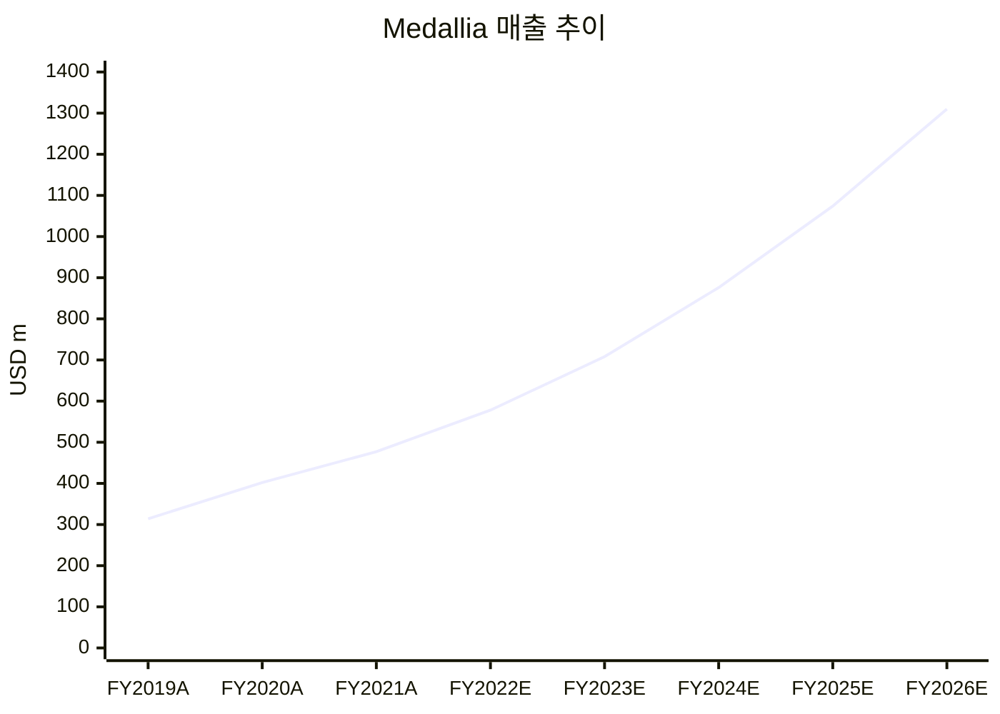
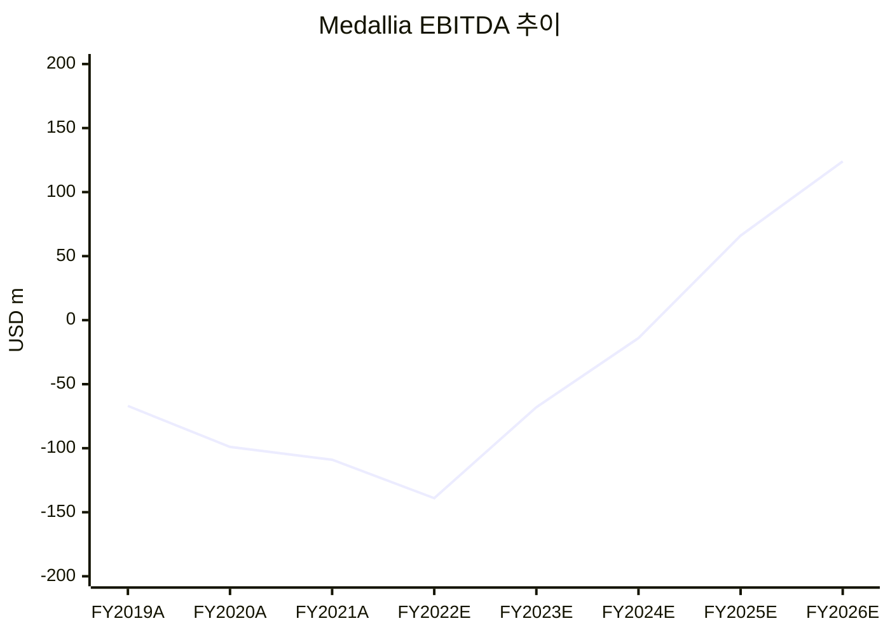

# Thoma Bravo의 Medallia 투자 손실 분석 보고서

## 경영진 요약

OnlyCFO의 2026년 5월 1일자 글 **“Thoma Bravo's $5B Medallia Loss | The PE Reckoning is Coming...”**는 Thoma Bravo의 2021년 Medallia 인수가 결국 채권단 주도 구조조정으로 귀결되며 약 **50억~51억 달러의 에쿼티 손실**로 이어졌다는 문제의식을 제기한다. 핵심 팩트는 대체로 외부 보도와 일치한다. 2021년 인수는 **전액 현금, 기업가치 64억 달러**, 주당 **34달러** 조건으로 체결됐고, 사모대출 시장에서 조달한 **18억 달러 규모의 recurring-revenue loan**이 결합된 전형적 소프트웨어 LBO였다. 그러나 Medallia는 인수 시점에도 **GAAP 기준 이익·현금창출력이 약했고**, 거래 프록시상으로도 **FY2025까지는 unlevered FCF가 음수**로 예상될 만큼 “미래의 고성장 + 대폭적인 수익성 개선”이 전제된 딜이었다. 이후 고금리, PIK 이자 누적, 추가 차입, 소프트웨어 멀티플 압축, 실행 부진이 겹치면서 구조가 붕괴했다. 2026년 봄에는 **총차입이 약 28억~30억 달러**, 연간 채무서비스가 **약 3억 달러**, 연간 이익이 **약 2억 달러** 수준으로 전해졌고, Blackstone 계열 BCRED는 Medallia 대출을 **액면의 60.3**으로 평가하며 non-accrual로 분류했다. 결론적으로 이번 손실은 단일한 “AI 충격”보다 **과도한 매입가, 현금흐름보다 ARR에 기대어 설계된 차입 구조, 금리 상승, 출구시장 경색, 운영·제품 전환 실행 리스크**가 중첩된 결과로 보는 것이 가장 타당하다. citeturn3view0turn13search1turn21search4turn24view2turn25view0turn30view0turn30view2turn9view1turn32news34

## 원문 기사 정밀 요약

해당 글은 Substack 뉴스레터 **OnlyCFO**에 실린 장문 분석 글로, 제목은 **“Thoma Bravo's $5B Medallia Loss | The PE Reckoning is Coming...”**, 부제는 **“Inside how Medallia broke and what it means for the rest of software”**다. 발행일은 **2026년 5월 1일**, 저자는 페이지 및 아카이브 표기상 **OnlyCFO**다. 형식상으로는 1차 취재 기사라기보다, 공개 자료와 언론보도·대출 마크 데이터를 엮어 해석한 **오피니언성 분석 뉴스레터**에 가깝다. citeturn3view0turn1search1turn1search3

기사의 중심 주장에는 세 가지 축이 있다. 첫째, 소프트웨어 LBO의 상당수가 향후 몇 년간 차환·연장에 실패할 수 있으며, Medallia는 그 전조라는 주장이다. 둘째, Medallia는 2021년 최고점 부근에서 인수됐고, 채권단이 더 이상 PIK 연장을 허용하지 않으면서 에쿼티가 소멸 단계에 들어갔다는 것이다. 셋째, 이 사안은 단순히 한 건의 실패가 아니라, **사모신용의 가격발견 한계와 고평가 소프트웨어 자산의 취약성**을 드러낸다는 점이다. 글은 이를 강조하기 위해 “**Private Equity is in Trouble…**”, “**Lenders Take The Keys to Medallia**”, “**worth zero**” 같은 짧고 강한 표현을 사용한다. citeturn3view0

다만 기사에서 가장 강한 문장들은 대부분 **보도·평가 데이터에 기대어 방향성을 제시**하는 수준이지, Medallia의 2022년 이후 실제 감사재무제표에 근거한 정밀 검증은 아니다. 이 한계는 중요하다. Medallia는 2021년 10월 비상장화 이후 더 이상 정기 공시를 하지 않으므로, 기사가 제시하는 EBITDA·부채·이자부담 수치는 대체로 **채권단 평가, 구조조정 보도, 시장 소식통**에 기반한 추정치다. 따라서 이 글은 “정답”이라기보다, 공개 신용마크와 사모신용 스트레스 신호를 통해 본 **상당히 설득력 있는 해석**으로 읽는 편이 정확하다. citeturn3view0turn21search4turn32news34

기사의 핵심 팩트 중 상당수는 외부 자료와 대체로 맞아 떨어진다. **Medallia 인수 EV 64억 달러**, **채권단이 통제권을 인수하는 방향의 구조조정 협상**, **Thoma Bravo 및 공동투자자의 약 51억 달러 에쿼티 소멸 가능성**, **채무가 약 28억~30억 달러로 불어난 점**, 그리고 **BCRED의 대출 마크 하락**은 모두 공식 공시 또는 유력 매체 보도와 부합한다. 다만 “AI 때문에 소프트웨어 전체가 무너졌다”는 기사 특유의 서술 강도는 일부 과장돼 있으며, Blackstone 측 설명은 오히려 **실행 부진이 AI보다 더 직접적 원인**이었다는 쪽에 가깝다. citeturn30view0turn30view2turn9view1turn32news34

## Thoma Bravo의 인수 전략과 유사 사례

Thoma Bravo의 전형적 소프트웨어 인수 전략은 비교적 명확하다. **시장 지위가 강한 소프트웨어 회사를 전액 현금으로 사모화**하고, 필요 시 **사모신용·직접대출**을 결합한 레버리지 구조를 얹은 뒤, **운영 파트너 개입, 가격·세일즈·제품 포지셔닝 개선, 비용 구조 조정, 볼트온 M&A, 클라우드/AI 전환**을 통해 가치 창출을 시도한다. firm 설명에서도 Thoma Bravo는 경영진과 협력해 **“operating best practices”**를 도입하고 **성장 이니셔티브 및 인수**를 통해 **매출과 이익을 가속**한다고 밝히고 있다. Ellie Mae 사례에서는 가격 전략·M&A·운영 플레이북이 강조됐고, Ping Identity 사례에서는 클라우드 전환과 ForgeRock 인수가 핵심 가치창출 축으로 제시됐다. citeturn17search5turn18search6turn17search8

Medallia 거래 역시 같은 문법이었다. 2021년 7월 발표 기준 **주당 34달러, EV 64억 달러의 전액 현금 거래**였고, 완료 후 비상장사가 됐다. 거래 당시 Morgan Stanley 분석은 Medallia의 **CY2021E AV/Revenue를 9.3배**, 스트리트 케이스 기준 **9.4배**로 제시했다. 즉, Thoma Bravo는 Medallia를 단순 저가 매입한 것이 아니라, **향후 성장 지속과 수익성 개선을 상당 부분 선반영한 가격**에 매입했다. 딜이 성공하려면 “성장 둔화가 크지 않으면서도, 몇 년 안에 EBITDA와 FCF가 가파르게 개선”되어야 했다. citeturn13search1turn24view2

아래 표는 Medallia와 비교 가능한 Thoma Bravo의 주요 소프트웨어 거래들을 정리한 것이다.

| 거래 대상 | 발표·완료 시점 | 거래 규모 | 구조 | 알려진 결과 |
|---|---:|---:|---|---|
| Ellie Mae | 2019년 | 약 37억 달러 지분가치 | 전액 현금 사모화 | 2020년 ICE에 **110억 달러**로 매각된 대표적 성공 사례 |
| RealPage | 2020년 발표 / 2021년 완료 | 약 102억 달러 EV | 전액 현금 사모화 | 거래 완료 후 비상장 전환 |
| SailPoint | 2022년 발표 / 2022년 완료 | 약 69억 달러 EV | 전액 현금 사모화 | 거래 완료 후 비상장 전환 |
| Ping Identity | 2022년 발표 / 2022년 완료 | 약 28억 달러 EV | 전액 현금 사모화 | 2023년 ForgeRock 인수, 결합회사 ARR이 **10억 달러에 근접**하고 FCF 창출 강조 |
| Coupa Software | 2022년 발표 / 2023년 완료 | 약 80억 달러 EV | 전액 현금 사모화 + ADIA 소수지분 | 거래 완료 후 비상장 전환 |
| Medallia | 2021년 발표 / 2021년 완료 | 약 64억 달러 EV | 전액 현금 사모화 + 사모신용 레버리지 | 2026년 채권단 주도 구조조정, 에쿼티 사실상 소멸 국면 |

자료: 각 사 및 Thoma Bravo 보도자료, 관련 딜 설명 자료. citeturn18search0turn18search6turn17search5turn17search1turn17search0turn17search4turn17search7turn17search3turn17search8turn17search6turn17search2turn13search1turn21search4turn30view0

이 비교에서 중요한 점은 Thoma Bravo의 전략 자체가 항상 실패하는 것은 아니라는 점이다. **Ellie Mae**처럼 고성장과 가격력, 운영 개선, 명확한 전략적 매수자 출구가 맞아떨어지면 대형 성공 사례가 나온다. **Ping Identity**처럼 사모화 후 재편·M&A로 플랫폼 가치를 키우는 경우도 있다. 하지만 **Medallia**처럼 인수 시점 현금흐름이 약하고, 인수 후 몇 년간 실적 턴어라운드가 필요하며, 그 사이 멀티플·금리·출구 환경이 나빠지면 같은 플레이북이 오히려 취약점이 된다. 즉, Medallia의 문제는 “Thoma Bravo식 운영 개선” 그 자체보다, **그 운영 개선이 도달해야 하는 속도와 금융구조의 인내 한계가 맞지 않았던 점**에 있다. citeturn18search6turn17search8turn13search1turn24view2turn30view0

## Medallia 인수 전후 실적과 거버넌스 변화

Medallia의 인수 전 사업모델은 명료했다. 매출의 약 **80%가 subscription**, 약 **20%가 professional services**였고, 플랫폼은 고객경험(CX)에서 직원경험(EX), 디지털 분석, 음성·텍스트·비디오 분석으로 확장 중이었다. 2021년 10-K는 subscription gross margin이 매우 높은 반면 professional services는 거의 손익분기 수준이라고 설명한다. 동시에 2020~2021년에 **LivingLens, Voci, Stella Connect, Sense360, Decibel** 같은 인수를 통해 비설문형 신호, 영상·음성·디지털 애널리틱스를 붙이며 제품을 넓혔다. 즉, Medallia는 단순 설문 툴이 아니라 **옴니채널 경험관리 플랫폼**으로 포지셔닝되어 있었다. citeturn19view5turn28view0turn28view1

그러나 재무는 취약했다. FY2019~FY2021에 걸쳐 매출은 빠르게 성장했지만, 영업손실이 확대됐고, 영업현금흐름은 FY2021에 겨우 플러스로 전환했다. LBO에 필요한 “이미 검증된 현금창출력”보다는, **장래의 잉여현금흐름 개선 기대**가 더 큰 회사를 레버리지로 인수한 셈이었다. 이는 프록시에 담긴 경영진 전망과도 일치한다. 거래 시점 회사 계획은 FY2024까지 EBITDA 적자, FY2025까지 unlevered FCF 적자를 전제하고 있었다. 즉, 인수 당시부터 **초기 몇 년은 부채상환보다 성장·전환이 우선**인 구조였다. citeturn20view0turn36view0turn25view0

### 인수 전 공개 실적

| 회계연도 | 매출 | 영업손실 | EBITDA | EBITDA 마진 | 영업현금흐름 | 추정 FCF | 순매출유지율 | 구독 비중 |
|---|---:|---:|---:|---:|---:|---:|---:|---:|
| FY2019A | 313.6 | -80.4 | 약 -66.6 | 약 -21.2% | -15.2 | 약 -26.5 | 116% | 79% |
| FY2020A | 402.5 | -114.9 | 약 -99.3 | 약 -24.7% | -1.6 | 약 -23.6 | 119% | 78% |
| FY2021A | 477.2 | -138.0 | 약 -109.0 | 약 -22.8% | 1.7 | 약 -19.2 | 115% | 80% |
| Jul-2021 LTM | 472.0 billings | — | — | — | — | — | 112% | 81% |

주: 여기서 EBITDA는 공개 10-K의 영업손실과 감가상각·상각비를 사용한 **근사치**이며, 회사가 공시한 비GAAP EBITDA는 아니다. FCF는 영업현금흐름에서 유형자산·기타 투자성 지출을 차감한 **근사치**다. Jul-2021 LTM의 472.0은 trailing-12-month subscription billings다. citeturn20view0turn20view1turn19view3turn19view5turn36view0turn36view2turn27view3turn27view4turn27view0

### 거래 시점 경영진 계획과 최신 구조조정 신호

| 회계연도 | 매출 전망 | EBITDA 전망 | EBITDA 마진 | UFCF 전망 | UFCF 마진 |
|---|---:|---:|---:|---:|---:|
| FY2022E | 578 | -139 | -24.0% | -180 | -31.1% |
| FY2023E | 708 | -68 | -9.6% | -124 | -17.5% |
| FY2024E | 876 | -14 | -1.6% | -74 | -8.4% |
| FY2025E | 1,074 | 66 | 6.1% | -32 | -3.0% |
| FY2026E | 1,310 | 124 | 9.5% | 32 | 2.4% |
| 2026년 구조조정 국면의 외부 추정 | **비공개** | 약 200 | 매출 비공개로 산출 불가 | **비공개** | 산출 불가 |

주: FY2022E~FY2026E는 **Thoma Bravo 인수 당시 Medallia 경영진의 장기 계획치**이며 실제 실적이 아니다. 2026년 약 200은 구조조정 보도에 등장하는 **연간 earnings / EBITDA 수준 추정치**다. 비상장 전환 이후 Medallia의 연도별 실제 매출·현금흐름·마진은 공개되지 않았다. citeturn25view0turn31search5turn30view2

위 두 차트는 **FY2019A~FY2021A 실제치**와 **FY2022E~FY2026E 거래 시점 전망치**를 결합한 것이다. 핵심은 인수 당시 투자논리가 “이미 높은 현금창출을 담보로 한 안정적 LBO”가 아니라, **매출을 5년 내 2배 이상 키우고 EBITDA를 -139에서 +124로 뒤집는 고난도 전환 시나리오**에 크게 의존했다는 점이다. citeturn25view0turn20view0turn36view0

고객 유지 지표도 완전히 무너지기 전부터 둔화 조짐이 있었다. 공개 자료상 **dollar-based net revenue retention**은 FY2019 **116%**, FY2020 **119%**, FY2021 **115%**, 2021년 7월 기준 **112%**였다. 100%를 넘는다는 점에서 순증은 유지됐지만, **기존 고객 확장 강도는 낮아지고 있었다**고 해석할 수 있다. 반면 2021년 10월 이후의 **실제 churn, logo retention, net retention**은 공개되지 않는다. 따라서 기사나 시장보도가 암시하는 “고객 이탈”을 구체적 수치로 검증하기는 어렵다. citeturn19view3turn27view3turn32news34

거버넌스 변화는 인수 후 sponsor 개입 강도를 보여준다. 인수 발표 당시 Medallia CEO는 **Leslie Stretch**였고, 2023년 3월 **Joe Tyrrell**이 CEO로 선임됐다. 이후 2025년 1월에는 **Mark Bishof**가 회장 겸 CEO로 임명되며, 발표문상 그는 **Thoma Bravo Operating Partner인 Mike Lipps의 뒤**를 이었다. 같은 발표에서 CFO·Chief Transformation Officer·General Counsel·Chief of Staff/Head of Corporate Development 등 핵심 리더십도 함께 재편됐다. 이는 sponsor가 단순 재무투자자가 아니라, **경영진 교체와 전략 전환에 직접 개입하는 운영형 PE 모델**을 강하게 적용했다는 뜻이다. citeturn15view0turn15view1turn13search8

제품 전략은 인수 후 더 분명하게 AI·대화형 인텔리전스 쪽으로 이동했다. 2024년에는 **생성형 AI 기반 네 가지 신기능**을, 2025년에는 **일곱 가지 AI 기반 기능과 survey-centric 프로그램을 넘어선 미래 CX 비전**을 발표했다. 즉, 회사는 설문 중심 VoC에서 **옴니채널 신호 + 대화 데이터 + 생성형 AI 기반 액션 플랫폼**으로의 피벗을 시도하고 있었다. 이 방향은 전략적으로 맞지만, 동시에 Qualtrics·Zendesk·컨택센터 AI·agentic AI 플레이어와의 경쟁을 한층 격화시킨다. citeturn29search0turn29search1turn29search3turn29search12

## 오십억달러 손실의 원인 분석

가장 중요한 원인은 **인수가격과 자본구조의 조합**이었다. Morgan Stanley 자료상 Medallia는 거래 시점에 **CY2021E 기준 9.3배, CY2022E 기준 7.6배 매출 멀티플**로 평가됐다. 같은 프록시의 선행 소프트웨어 거래 표에서 Proofpoint가 **9.3배**, RealPage가 **8.2배**, QAD가 **5.3배**, Sophos가 **5.1배**였음을 감안하면, Medallia는 당시 선행 PE 소프트웨어 거래 대비 **상단부에 가까운 가격**이었다. 사모화 프리미엄도 2021년 6월 10일 unaffected 종가 대비 약 **20%**, 30일 평균 대비 약 **29%**였다. Orlando Bravo가 2026년 CNBC 인터뷰에서 “성장률을 과대외삽해 너무 비싸게 샀다”고 인정한 것은, 숫자로 보아도 상당히 설득력이 있다. citeturn24view2turn25view0turn21search4turn32news33

두 번째 원인은 **인수 당시부터 취약했던 현금흐름 질**이다. FY2021의 공개 실적만 보더라도 Medallia는 매출 4.8억 달러에 대해 **영업손실 1.38억 달러**, **영업현금흐름 170만 달러**, **추정 FCF 약 -1,920만 달러** 수준이었다. 더 중요한 것은 거래 프록시에 담긴 경영진 계획인데, 여기서도 **FY2024까지 EBITDA 적자**, **FY2025까지 UFCF 적자**가 전제됐다. 다시 말해 이 거래는 “이미 현금이 나오는 기업에 레버리지를 얹는 LBO”가 아니라, **향후 수년간의 급격한 마진 개선이 필수 조건인 성장 베팅형 LBO**였다. 이런 구조는 시장 환경이 좋을 때는 견딜 수 있지만, 금리와 멀티플이 동시에 악화되면 즉시 취약해진다. citeturn36view0turn36view2turn25view0

세 번째 원인은 **ARR 기반 차입과 PIK 의존**이다. 보도에 따르면 2021년 인수금융은 **18억 달러 규모 recurring-revenue loan**이었고, 이후 이자 중 일부를 원금에 가산하는 **PIK 구조**가 활용됐다. 2026년 봄에는 총부채가 **약 28억~30억 달러**로 커졌고, 채권단은 더 이상의 유예를 거부한 채 통제권 이전 협상에 들어갔다. Bloomberg는 재구조화안이 **28억 달러 대출의 상당 부분을 주식으로 전환**하는 방향이라고 보도했고, Reuters는 회사가 **30억 달러 부채 부담** 아래에 있다고 전했다. 공개된 구조 전체를 확인할 수는 없지만, 기사의 “부채가 눈덩이처럼 불었다”는 주장은 **방향상 타당**하다. citeturn33search1turn34search0turn30view0turn30view2

네 번째 원인은 **금리 상승이 레버리지 구조를 결정적으로 훼손**했다는 점이다. Barron’s 요약에 따르면 Medallia 대출은 **SOFR + 600bp**, 최근 수익률이 **약 10%** 수준이었다. 이 조건을 Bloomberg·Reuters가 보도한 **28억~30억 달러 부채잔액**에 적용하면, 단순 계산상 연간 현금이자 부담은 **약 2.7억~3.0억 달러** 범위가 된다. 이는 시장보도에서 반복되는 “연간 채무서비스 약 3억 달러”와 잘 맞는다. 반면 외부 보도상 Medallia의 연간 이익은 **약 2억 달러** 수준으로 전해졌다. 이 경우 이자보상력이 부족해지고, sponsor가 신규 자본을 넣지 않는 한 구조조정 외 대안이 거의 사라진다. citeturn32news34turn30view0turn30view2turn31search5

다섯 번째 원인은 **시장 멀티플 압축과 출구시장 경색**이다. 2021년은 고성장 소프트웨어 멀티플이 극단적으로 높았던 시기였지만, 2025~2026년에는 AI 재평가와 고금리 장기화 속에서 소프트웨어 및 사모신용 전반의 가치평가가 보수화됐다. FT는 BCRED가 2025년 말 약 **94센트**, 2026년 초 **78센트** 수준으로 Medallia 대출 가치를 계속 낮춰 왔다고 전했고, 2026년 3월말 BCRED 공시는 Medallia를 **60.3**으로 표시했다. 2021년에 가능했던 “3~5년 후 더 높은 멀티플로 재매각/IPO”라는 전형적 출구 가정이 사실상 붕괴한 셈이다. citeturn5news32turn9view1

여섯 번째 원인은 **운영상의 실행과 전략 전환 리스크**다. Blackstone 측 설명에 따르면 Medallia의 부진은 “광범위한 AI 위협” 그 자체보다 **실행 문제**에 더 가까웠다. 그런데 인수 후 Medallia는 경영진 교체, AI 제품 전환, 제품 리포지셔닝, 파트너 생태계 재정비를 동시다발적으로 추진했다. 이는 장기적으로는 옳은 방향일 수 있으나, 레버리지 부담이 큰 상황에서는 **조직 전환의 시행착오와 제품 전환의 딜레이가 곧 신용위험**으로 번진다. AI는 직접 원인이라기보다, **가치평가 압박과 경쟁 가속**을 통해 이미 취약했던 구조를 더 어렵게 만든 외부 증폭 변수로 보는 편이 균형적이다. citeturn32news34turn15view1turn29search1turn29search12

### 기사 주장과 데이터의 정합성 점검

| 기사의 주장 | 확인 결과 | 평가 |
|---|---|---|
| Thoma Bravo의 약 50억 달러 지분이 사실상 0이 됐다 | Reuters는 **51억 달러 에쿼티 wipeout**, Bloomberg는 채권단이 **28억 달러 대출 대부분을 주식 전환**한다고 보도 | **대체로 일치** |
| 인수 가격은 약 9배 NTM 매출이었다 | 거래 프록시의 management case는 **9.3배**, street case는 **9.4배** | **정확** |
| 부채는 28억~30억 달러 수준까지 불었다 | Reuters는 **30억 달러**, Bloomberg는 **28억 달러**를 언급 | **방향상 일치** |
| 이자부담 약 3억 달러 vs EBITDA 약 2억 달러 | 구조조정 보도와 Barron’s의 금리 조건을 대입하면 충분히 **경제적으로 타당** | **개연성 높음** |
| AI가 소프트웨어·사모신용 위기의 핵심 배경이다 | 시장 재평가 요인은 맞지만, Blackstone은 Medallia 특수 원인을 **실행 부진**으로 더 강조 | **부분 타당, 다소 과장** |

자료: Reuters, Bloomberg, Barron’s, Medallia 거래 프록시, BCRED 공시. citeturn30view0turn30view2turn24view2turn32news34turn9view1

## 향후 리스크·기회와 투자·경영 시사점

Thoma Bravo에게 가장 큰 리스크는 **평판과 신용시장 관계**다. Medallia는 단순한 손실 프로젝트가 아니라, 2021년 팬데믹 말기 고평가·유연한 차입 조건·사모신용 가격발견의 취약성을 한꺼번에 상징하는 사례가 됐다. 특히 Reuters와 Bloomberg 보도는 sponsor가 추가 자본 투입보다 키 반환을 택했다는 점을 부각한다. 이는 향후 직접대출 시장에서 sponsor–lender 간 협상력과 조건 설정에 영향을 줄 수 있다. 반면 Thoma Bravo는 여전히 광범위한 소프트웨어 포트폴리오와 운영 실행력을 보유하고 있고, Orlando Bravo도 Medallia를 “outlier”로 규정하고 있다. 따라서 오히려 **향후 인수에서는 가격규율과 현금흐름 중심 구조를 강화하는 계기**가 될 수 있다. citeturn30view0turn32search5turn32news33

Medallia 자체에는 역설적으로 **기회도 존재**한다. 구조조정이 완료돼 부채가 대폭 줄어들면, 회사는 금리·원금상환 압박에서 벗어나 다시 **제품 혁신과 상업화**에 자원을 배분할 수 있다. 회사는 이미 2024~2026년에 걸쳐 생성형 AI, conversational intelligence, agentic AI 파트너십을 전면에 내세우고 있다. 고객경험 플랫폼 시장에서 Medallia가 가진 강점은 대규모 엔터프라이즈 설치기반, 옴니채널 데이터, 텍스트·음성·디지털 분석 통합 능력이다. 이 강점이 부채 경감과 함께 살아난다면, 회생 후 기업가치는 에쿼티 0과 별개로 다시 커질 수 있다. citeturn29search0turn29search1turn29search6turn29search12

하지만 리스크는 여전히 크다. 첫째, 구조조정 이후에도 **고객 유지와 리뉴얼**이 약하면 가치 회복은 제한된다. 둘째, 시장은 survey-centric CX보다 **대화형 AI, 실시간 행동데이터, 자동화 실행**을 선호하는 쪽으로 이동하고 있다. 셋째, sponsor 주도 거버넌스 개편이 잦을수록 고객·직원 신뢰 부담이 생긴다. 넷째, 사모신용 채권단이 지배주주가 되는 구조에서는 단기 현금보전과 장기 제품투자 사이 긴장이 생길 수 있다. 요컨대 Medallia의 향후 성패는 “부채를 줄였느냐”보다, **AI 시대에 제품과 GTM을 얼마나 빨리 재정렬하느냐**에 달려 있다. citeturn15view1turn29search3turn29search12turn32news34

투자자와 경영진이 얻어야 할 시사점은 분명하다. 첫째, **ARR는 신용 완충재가 아니라 출발점**일 뿐이며, 현금이자로 전환되는 순간의 경제성을 반드시 봐야 한다. 둘째, 고성장 소프트웨어 LBO는 멀티플과 금리 중 하나만 흔들려도 치명적이지만, 둘 다 흔들리면 sponsor 에쿼티는 매우 빠르게 0으로 수렴할 수 있다. 셋째, 제품 리더십이 유지되지 않으면 “좋은 소프트웨어 회사”와 “좋은 LBO 자산”은 완전히 다른 개념이 된다. Medallia는 제품적으로 여전히 의미 있는 회사일 수 있지만, 그 사실이 곧 2021년의 금융구조를 정당화해주지는 못했다. citeturn25view0turn30view0turn32news34

### 실행 가능한 권고안

- **Thoma Bravo는 향후 대형 소프트웨어 딜에서 인수가격 기준을 EV/Revenue보다 ‘현금이자 커버 후 FCF 전환 시점’ 기준으로 재설계해야 한다.** Medallia 프록시상 회사는 FY2025까지 UFCF가 음수였고, 실제 구조조정 국면에서는 약 3억 달러 채무서비스가 약 2억 달러 이익을 상회했다. 이는 entry multiple보다 **cash-interest bridge**가 더 중요한 심사 항목임을 보여준다. citeturn25view0turn31search5turn30view2

- **Medallia는 재무구조 정상화 이후 제품 포트폴리오를 ‘설문’이 아니라 ‘대화형 AI + 행동데이터 + 실행자동화’ 중심으로 명확히 재정의해야 한다.** 회사는 이미 2024년 4개 AI 기능, 2025년 7개 AI 기능, 2026년 agentic AI 파트너십을 발표했다. 앞으로는 이 기술 발표를 실제 리뉴얼 개선과 upsell로 연결하는 GTM 측정체계를 전면에 둬야 한다. citeturn29search0turn29search1turn29search12

- **채권단과 새 경영진은 12~18개월 안에 ‘고객유지·가격·제품사용’에 대한 외부 신뢰 신호를 만들어야 한다.** 비상장 이후 재무 투명성이 약해진 것이 Medallia 사례의 핵심 문제 중 하나였고, Barron’s도 외부인이 대출자산 질을 평가하기 어렵다고 지적했다. 최소한 핵심 KPI 고객사례, 제품 사용량, AI 기능 상용화, 순유지율 범주 같은 운영지표를 더 자주 시장에 제시해야 회복가치가 재평가될 수 있다. citeturn32news34turn29search6

### 주요 1차 자료와 한계

가장 신뢰도가 높은 1차 자료는 Medallia의 **2021년 10-K**, **2021년 7월말 10-Q**, **거래 관련 SEC 프록시 보충공시**, **Thoma Bravo·Medallia의 인수 발표/완료 보도자료**, 그리고 **Blackstone BCRED의 2026년 1분기 관련 SEC 공시**다. 이 보고서의 실적 표와 멀티플, 프리미엄, 경영진 장기계획, 대출 마크는 주로 이 자료들에서 도출했다. citeturn26search13turn26search0turn23view0turn25view0turn13search1turn21search4turn7search0turn7search6

한계도 분명하다. **Medallia의 2022년 이후 실제 연도별 매출·EBITDA·현금흐름·churn·제품별 매출 비중은 비상장 전환 후 공개되지 않았다.** 따라서 본 보고서의 post-acquisition 재무 분석은 **거래 시점의 management case**와 **2026년 구조조정 관련 외부 추정치 및 대출 마크**를 병행한 것이다. 특히 2026년 “약 2억 달러 이익” 수치는 감사재무제표가 아니라 시장보도·채권단 평가 문맥에서 제시된 추정치임을 명시한다. citeturn25view0turn30view0turn30view2turn32news34